# ChessMate - ROS2 Chess Robot

[](https://docs.ros.org/en/humble/)
[](https://www.raspberrypi.org/)
[](LICENSE)
[](https://hackaday.io/project/203400-chessmate-ros2-chess-robot)


**An AI chess master with expressive eyes, custom electronics, and a precision arm that will checkmate you with style!**

ChessMate is a fully autonomous chess-playing robot that physically moves pieces on a real chessboard. Built with ROS2, it combines professional-grade chess AI (Stockfish), custom electronics with home-fabricated PCBs, a 6-DOF SCARA robotic arm, and expressive animatronics to create an engaging chess opponent with personality.

## Introduction

### Key Features

| Category | Features |
|----------|----------|
| **Chess Intelligence** | Stockfish engine integration (skill levels 1-20), real-time move validation, FEN notation tracking, position analysis |
| **Robotic Precision** | 6-DOF SCARA arm, sub-millimeter positioning accuracy, adaptive gripping, four-corner calibration |
| **Board Sensing** | 64 hall effect sensors, custom CNC-fabricated PCBs, 8×8 NeoPixel LED matrix, real-time move detection |
| **User Interface** | OLED display with rotary encoder, expressive servo-driven eyes, text-to-speech synthesis |
| **Architecture** | Three-controller distributed design (Pi + 2× Pico), topic-based ROS2 communication, mock/real mode support |

---

## Table of Contents

- [Introduction](#introduction)
- [Hardware Architecture](#hardware-architecture)
  - [PCB Design](#pcb-design)
  - [SCARA Arm](#scara-arm)
  - [Animatronics Head](#animatronics-head)
  - [Peripherals](#peripherals)
- [Software Architecture](#software-architecture)
  - [ROS2 Nodes](#ros2-nodes)
    - [chess_engine_server](#chess_engine_server)
    - [arduino_communication](#arduino_communication)
    - [game_management](#game_management)
  - [Active Topics](#active-topics)
  - [Serial Protocol](#serial-protocol)
- [Controllers](#controllers)
  - [ChessBoard Controller](#chessboard-controller)
  - [Robot Controller](#robot-controller)
- [Communication Flow](#communication-flow)
  - [Game Flow State Machine](#game-flow-state-machine)
  - [System Interaction Flows](#system-interaction-flows)
    - [System Initialization Flow](#system-initialization-flow)
    - [Computer Move Execution Flow](#computer-move-execution-flow)
    - [Human Move Detection Flow](#human-move-detection-flow)
    - [LCD Display and Menu Operation Flow](#lcd-display-and-menu-operation-flow)
    - [Robot Animatronics Flow](#robot-animatronics-flow)
- [Getting Started](#getting-started)
- [Testing](#testing)
  - [Overview](#overview)
  - [Test Levels](#test-levels)
  - [Running Tests](#running-tests)
  - [Monitoring & Diagnostics](#monitoring--diagnostics)
  - [Diagnostic Session Example](#diagnostic-session-example)
  - [Troubleshooting](#troubleshooting)

---

## Hardware Architecture

ChessMate uses a distributed three-controller architecture. Each controller handles specific responsibilities, communicating via serial protocols.

| Controller | Role | Responsibilities |
|------------|------|------------------|
| **Raspberry Pi** | The Brain | Chess engine integration and move calculation, game state management and rule enforcement, audio processing for speech and sound effects, system-wide coordination and safety oversight |
| **Board Controller** | The Senses | Real-time monitoring of all 64 chess piece positions, visual feedback through LED matrix, user interface management (OLED, buttons, rotary encoder), move detection and validation, player interaction handling |
| **Mechanical Controller** | The Body | Precision robotic arm movement control, adaptive gripper operation for different pieces, animatronic facial expressions and eye movements, safety systems and emergency stop coordination, real-time motion execution |

The diagram below shows the physical hardware components and their connections. The Raspberry Pi serves as the central brain, communicating with two Pi Pico microcontrollers via USB serial at 9600 baud. The Board Controller handles all sensing and user interface components, while the Mechanical Controller manages actuation and motion.

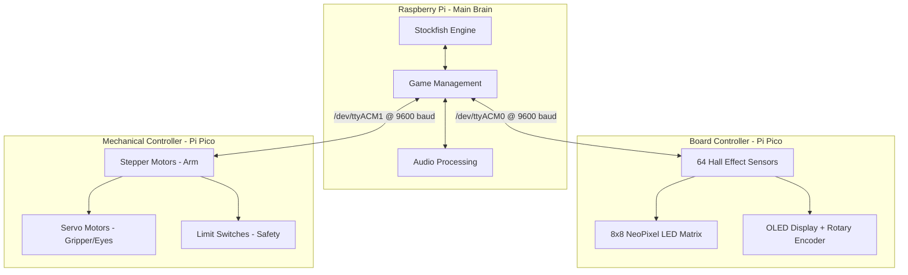
```mermaid
graph TB
    subgraph "Raspberry Pi - Main Brain"
        A[Stockfish Engine]
        B[Game Management]
        C[Audio Processing]
    end

    subgraph "Board Controller - Pi Pico"
        D[64 Hall Effect Sensors]
        E[8x8 NeoPixel LED Matrix]
        F[OLED Display + Rotary Encoder]
    end

    subgraph "Mechanical Controller - Pi Pico"
        G[Stepper Motors - Arm]
        H[Servo Motors - Gripper/Eyes]
        I[Limit Switches - Safety]
    end

    A <--> B
    B <--> C
    B <-->|"/dev/ttyACM0 @ 9600 baud"| D
    B <-->|"/dev/ttyACM1 @ 9600 baud"| G
    D --> E
    D --> F
    G --> H
    G --> I
```

### PCB Design

Custom CNC-fabricated PCBs provide the foundation for the chessboard sensing system.

| Specification | Value |
|---------------|-------|
| Sensors | 64 hall effect sensors arranged in 8×8 grid |
| Interface | I2C expanders for efficient GPIO usage |
| Fabrication | CNC-milled PCBs with custom routing |
| Calibration | Baseline recording with threshold-based detection |

**Sensor Calibration:** Place pieces in starting positions → record baseline → set detection thresholds → validate all squares.

#### Chessboard Visuals

| CAD Rendering | Fabricated Chessboard |
|:-------------:|:---------------------:|
| 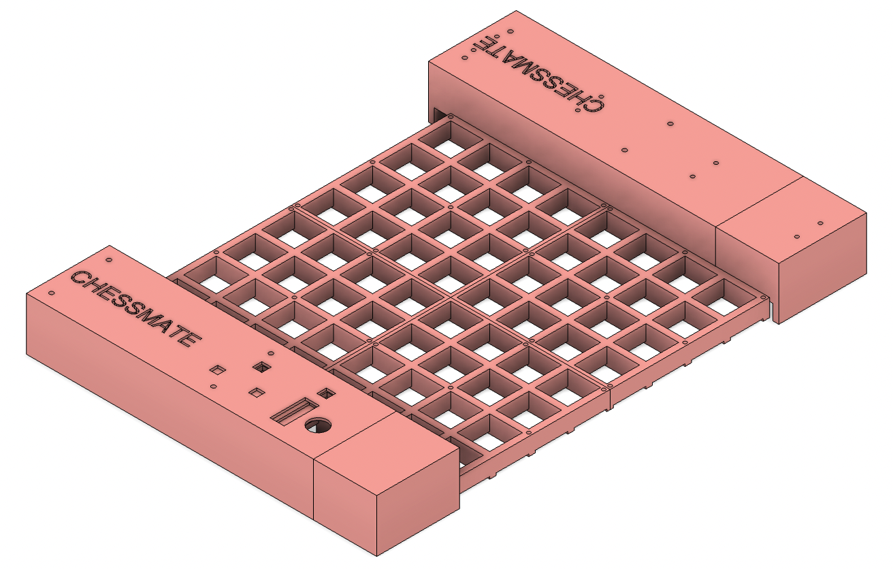 | 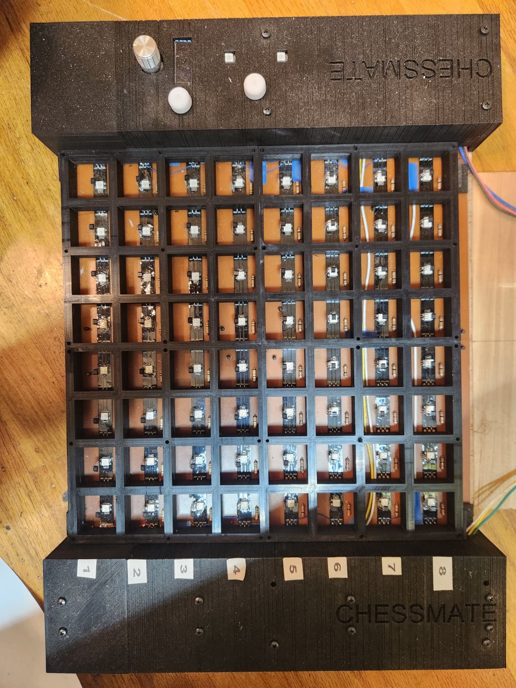 |
| *3D CAD model showing board layout and sensor placement* | *Assembled chessboard with LED matrix and piece detection* |

| CNC Isolation-Milled PCB |
|:------------------------:|
| 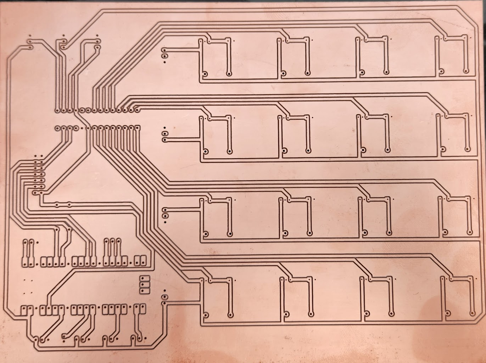 |
| *Custom PCB with hall effect sensors created using CNC isolation milling* |

<!--
TODO: Add actual image files to assets/images/ directory:
- chessboard_cad.png: CAD rendering of complete chessboard design
- chessboard_photo.jpg: Photo of assembled/fabricated chessboard
- pcb_cnc_milled.jpg: Close-up photo of CNC isolation-milled PCB with hall effect sensors
-->

### SCARA Arm

The 6-DOF SCARA robotic arm provides precise piece manipulation across the entire chessboard.

| Specification | Value |
|---------------|-------|
| Arm Type | 6-DOF SCARA |
| Workspace | Full 8×8 chessboard coverage |
| Repeatability | Sub-millimeter positioning accuracy |
| Actuation | NEMA 17 steppers with microstepping |
| Gripper | Adaptive gripping for different piece sizes |

**Arm Calibration:** Home position via limit switches → four-corner board registration → 64-point square mapping → EEPROM storage.

#### SCARA Arm Visuals

| CAD Rendering | Assembled Arm |
|:-------------:|:-------------:|
| 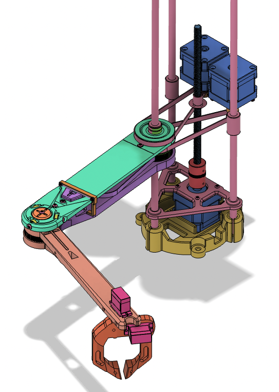 | 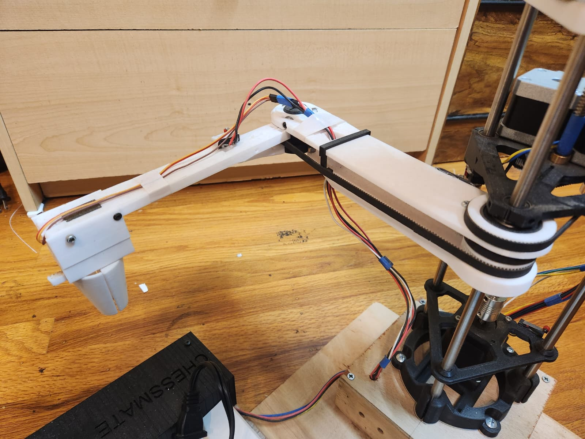 |
| *6-DOF SCARA arm CAD model showing joint configuration* | *Assembled robotic arm mounted on chess platform* |

| Gripper Mechanism |
|:-----------------:|
| 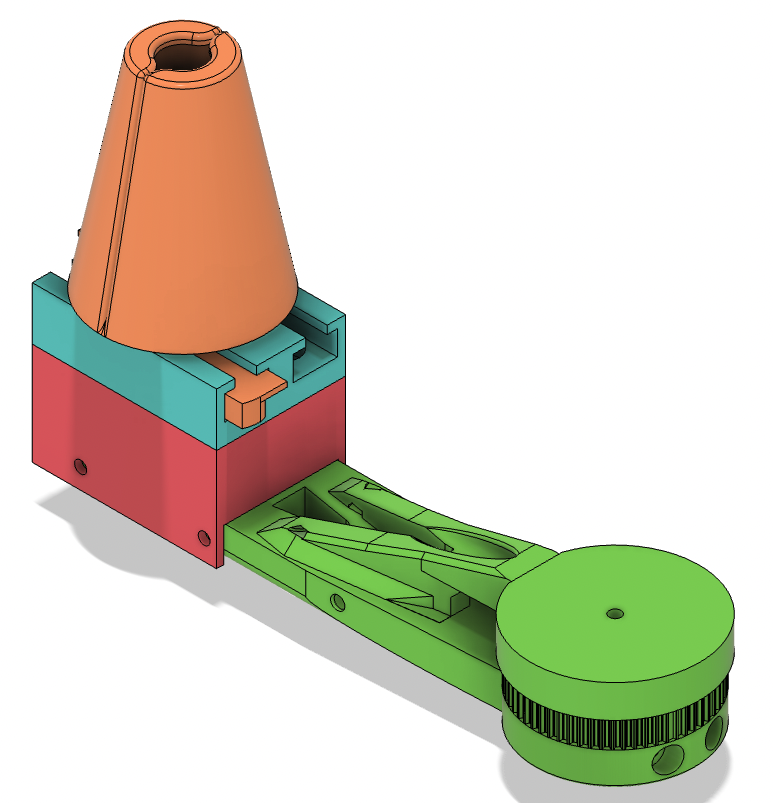 |
| *Adaptive gripper mechanism for handling different chess piece sizes* |

<!--
TODO: Add actual image files to assets/images/ directory:
- scara_arm_cad.png: CAD rendering showing 6-DOF arm design and joint layout
- scara_arm_photo.jpg: Photo of fully assembled robotic arm
- gripper_detail.jpg: Close-up photo of gripper mechanism
-->

### Animatronics Head

Servo-driven expressive eyes and facial movements create an engaging opponent with personality.

| Component | Description |
|-----------|-------------|
| Eyes | Servo-driven with pan/tilt movement |
| Expressions | Victory, thinking, surprise, satisfaction |
| Controllers | Dual Pi Pico microcontrollers |

#### Animatronics Head Visuals

| CAD Rendering | Assembled Head |
|:-------------:|:--------------:|
| 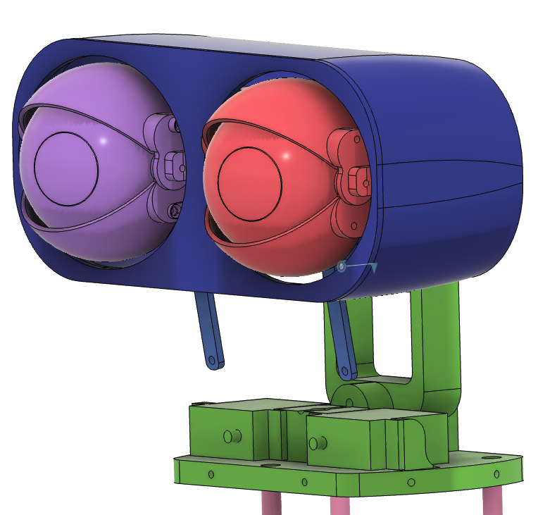 | 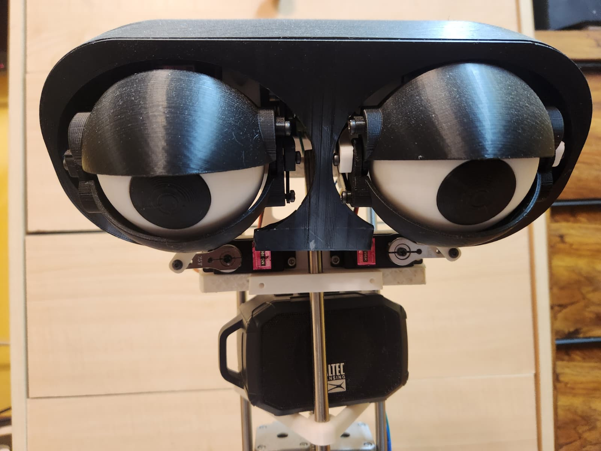 |
| *Expressive head CAD model with servo mounting points* | *Assembled animatronics head with expressive features* |

| Eye Mechanism Detail |
|:--------------------:|
|  |
| *Servo-driven eye movement mechanism with pan/tilt capability* |

<!--
TODO: Add actual image files to assets/images/ directory:
- animatronics_head_cad.png: CAD rendering of expressive head design
- animatronics_head_photo.jpg: Photo of assembled head with servo-driven eyes
- eye_mechanism_detail.jpg: Close-up photo showing eye movement mechanism
-->

### Peripherals

User interface and feedback components managed by the Board Controller.

| Component | Description |
|-----------|-------------|
| Display | 8×8 NeoPixel LED matrix for move visualization |
| OLED | SSD1306 display for menu and game status |
| Input | Rotary encoder with push button |
| Audio | Text-to-speech synthesis via Raspberry Pi |

For detailed hardware documentation, CAD files, and schematics: [Hackaday Project](https://hackaday.io/project/203400-chessmate-ros2-chess-robot)

---

## Software Architecture

The diagram below illustrates the topic-based communication between ROS2 nodes. The game_management node orchestrates all game logic, requesting move calculations from chess_engine_server and dispatching physical moves to arduino_communication. Human moves detected by the board sensors flow back through the communication node to the game manager.

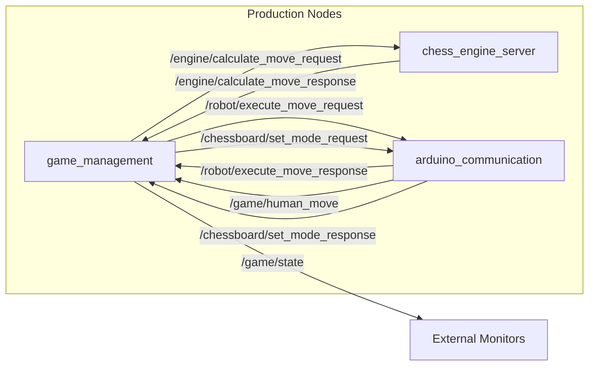
```mermaid
graph LR
    subgraph "Production Nodes"
        GM[game_management]
        CE[chess_engine_server]
        AC[arduino_communication]
    end

    GM -->|"/engine/calculate_move_request"| CE
    CE -->|"/engine/calculate_move_response"| GM
    GM -->|"/robot/execute_move_request"| AC
    AC -->|"/robot/execute_move_response"| GM
    AC -->|"/game/human_move"| GM
    GM -->|"/chessboard/set_mode_request"| AC
    AC -->|"/chessboard/set_mode_response"| GM
    GM -->|"/game/state"| EXT[External Monitors]
```

### ROS2 Nodes

ChessMate uses three production nodes that work together to orchestrate complete chess games:

#### chess_engine_server

Stockfish chess engine integration providing move calculation and position evaluation.

| Property | Value |
|----------|-------|
| **Package** | `chessmate` |
| **Executable** | `chess_engine_server.py` |
| **Launch** | `ros2 run chessmate chess_engine_server.py` |

**Topics:**
| Topic | Direction | Type | Description |
|-------|-----------|------|-------------|
| `/engine/calculate_move_request` | Subscribe | `String` | FEN position with parameters |
| `/engine/calculate_move_response` | Publish | `String` | Best move and evaluation |

**Parameters:**
| Parameter | Default | Description |
|-----------|---------|-------------|
| `stockfish_path` | `/usr/games/stockfish` | Path to Stockfish binary |
| `default_skill_level` | `10` | Engine skill (1-20) |
| `default_time_limit` | `5.0` | Thinking time in seconds |

#### arduino_communication

Serial communication interface with Pi Pico microcontrollers for board sensing and robot control.

| Property | Value |
|----------|-------|
| **Package** | `chessmate` |
| **Executable** | `arduino_communication.py` |
| **Launch** | `ros2 run chessmate arduino_communication.py` |

**Topics:**
| Topic | Direction | Type | Description |
|-------|-----------|------|-------------|
| `/game/human_move` | Publish | `String` | Detected human moves (UCI format) |
| `/robot/execute_move_request` | Subscribe | `String` | Robot movement commands |
| `/robot/execute_move_response` | Publish | `String` | Robot movement confirmations |
| `/chessboard/set_mode_request` | Subscribe | `String` | Chessboard mode commands |
| `/chessboard/set_mode_response` | Publish | `String` | Chessboard mode confirmations |

**Parameters:**
| Parameter | Default | Description |
|-----------|---------|-------------|
| `chessboard_port` | `/dev/ttyACM0` | Serial port for board controller |
| `robot_port` | `/dev/ttyACM1` | Serial port for robot controller |
| `baud_rate` | `9600` | Serial communication baud rate |
| `hardware_mode` | `mock` | Operating mode (`mock` or `real`) |

#### game_management

Game orchestration node managing turn-taking, move validation, and game state.

| Property | Value |
|----------|-------|
| **Package** | `chessmate` |
| **Executable** | `game_management.py` |
| **Launch** | `ros2 run chessmate game_management.py` |

**Topics:**
| Topic | Direction | Type | Description |
|-------|-----------|------|-------------|
| `/game/state` | Publish | `GameState` | Current game status and board position |
| `/game/control` | Subscribe | `String` | Game control commands |
| `/game/human_move` | Subscribe | `String` | Human moves from chessboard |
| `/engine/calculate_move_request` | Publish | `String` | Engine calculation requests |
| `/engine/calculate_move_response` | Subscribe | `String` | Engine calculation responses |
| `/robot/execute_move_request` | Publish | `String` | Robot movement commands |
| `/robot/execute_move_response` | Subscribe | `String` | Robot movement confirmations |

**Parameters:**
| Parameter | Default | Description |
|-----------|---------|-------------|
| `hardware_mode` | `mock` | Operating mode (`mock` or `real`) |
| `auto_start` | `true` | Auto-start game on initialization |
| `skill_level` | `10` | Stockfish skill level (1-20) |
| `time_limit` | `5.0` | Engine thinking time in seconds |

### Active Topics

| Topic | Type | Description |
|-------|------|-------------|
| `/game/state` | GameState | Current game status and board position |
| `/game/control` | String | Game control commands (start, pause, reset) |
| `/game/human_move` | String | Detected human moves from chessboard (UCI format) |
| `/engine/calculate_move_request` | String | Engine calculation requests (FEN position) |
| `/engine/calculate_move_response` | String | Engine responses (best move + evaluation) |
| `/robot/execute_move_request` | String | Robot movement commands (6-char format) |
| `/robot/execute_move_response` | String | Robot movement confirmations |

### Serial Protocol

**ChessBoard Controller (/dev/ttyACM0):**
```
Host → Board: "mode:real\n" | "mode:mock\n" | "legal:e2e4,d2d4,g1f3\n"
Board → Host: "e2e4\n" (4-character UCI move)
```

**Robot Controller (/dev/ttyACM1):**
```
Host → Robot: "mode:real\n" | "mode:mock\n" | "move:e2pe4p\n"
Robot → Host: "ACK: Executing move\n" → "DONE: Move complete\n"

6-Character Move Format: [from_square][piece][to_square][dest_piece]
Examples: e2pe4p (pawn e2→e4), g1nf3n (knight g1→f3), e1kg1k (castling)
```

---

## Controllers

The ChessMate system uses two Pi Pico microcontrollers that handle sensing, actuation, and user interface components. Both controllers communicate with the Raspberry Pi host via USB serial at 9600 baud.

### ChessBoard Controller

The ChessBoard Controller manages board sensing, LED matrix display, and user interface components.

#### Features

| Feature | Description |
|---------|-------------|
| Board Sensing | Hall effect sensors detect piece positions on all 64 squares |
| LED Matrix Display | 8×8 RGB LED matrix (WS2812B/NeoPixel) for move highlighting and game status |
| User Interface | Status LEDs for human/computer turn indicators, buttons for move confirmation and hints |
| Mock Mode | Runtime mode selection with intelligent move simulation (2-8 second timing) |

#### Hardware Configuration

| Component | Specification |
|-----------|---------------|
| Microcontroller | Raspberry Pi Pico (RP2040) |
| LED Matrix | 8×8 RGB (WS2812B/NeoPixel) |
| Sensors | 64 hall effect sensors (one per square) |
| Communication | Serial1 (GPIO 0/1) to Raspberry Pi |

#### Pin Configuration

| Pin | Function |
|-----|----------|
| GPIO 0 | Serial1 TX (to Raspberry Pi) |
| GPIO 1 | Serial1 RX (from Raspberry Pi) |
| USB | Debug output (Serial monitor) |

#### Command Protocol

**Mode Commands:**
```
mode:real    - Enable real hardware mode
mode:mock    - Enable mock simulation mode
```

**Game Commands:**
| Command | Description |
|---------|-------------|
| `init` | Initialize board for new game |
| `occupancy:pos1:pos2:...` | Set initial piece positions |
| `legal:move1:move2:...` | Set legal moves for current position |
| `hint:move` | Set hint move to display |
| `check:square1:square2:...` | Highlight check squares |
| `start` | Begin human turn |
| `comp:move` | Execute computer move |
| `override:move` | Override/undo move |
| `checkmate:king_pos:move` | Display checkmate |
| `reset` | Reset board state |

**Responses:**
| Response | Description |
|----------|-------------|
| `e2e4` | 4-character move notation |
| `ffff` | Hint override signal |

### Robot Controller

The Robot Controller manages the robotic arm that executes computer chess moves, including stepper motors, gripper servo, and animatronics.

#### Features

| Feature | Description |
|---------|-------------|
| USB Serial Communication | Direct communication with Raspberry Pi host via `/dev/ttyACM1` |
| Move Execution | Handles 6-character chess move commands (e.g., `e2pe4p`) |
| State Management | Tracks robot state (IDLE, MOVING, HOMING, etc.) |
| Mock Mode | Software simulation for testing (3-8 second move timing) |

#### Hardware Configuration

| Component | Specification |
|-----------|---------------|
| Microcontroller | Raspberry Pi Pico (RP2040) |
| Stepper Motors | 3-axis (X, Y, Z) with shared enable |
| Gripper | Servo-controlled |
| Safety | Limit switches on all axes |

#### Pin Configuration

| Pin | Function |
|-----|----------|
| GPIO 2 | X-Axis Step |
| GPIO 3 | Y-Axis Step |
| GPIO 4 | Z-Axis Step |
| GPIO 5 | X-Axis Direction |
| GPIO 6 | Y-Axis Direction |
| GPIO 7 | Z-Axis Direction |
| GPIO 8 | Stepper Enable (shared) |
| GPIO 9 | X-Axis Limit Switch |
| GPIO 10 | Y-Axis Limit Switch |
| GPIO 11 | Z-Axis Limit Switch |
| GPIO 13 | Gripper Servo |
| USB | Communication to Raspberry Pi |

#### Command Protocol

**Mode Commands:**
```
mode:mock    - Enable mock simulation mode
mode:real    - Enable real hardware mode
```

**System Commands:**
| Command | Description |
|---------|-------------|
| `init` | Initialize robot systems |
| `home` | Home robot to origin position |
| `status` | Get current robot status |

**Move Commands:**

Format: `<from><piece><to><dest_piece>` (6 characters)

| Field | Description |
|-------|-------------|
| `from` | Source square (e.g., `e2`) |
| `piece` | Piece type (`p`=pawn, `r`=rook, `n`=knight, `b`=bishop, `q`=queen, `k`=king) |
| `to` | Destination square (e.g., `e4`) |
| `dest_piece` | Piece type at destination (same as source, or `x` for capture) |

**Single Character Commands:**
| Command | Description |
|---------|-------------|
| `i` | Wake up robot (start animations) |
| `s` | Sleep robot (idle animations) |
| `j` | Home Z-axis only |
| `z` | Home all axes |

**Response Format:**
```
ROBOT: <message>
```

---

## Communication Flow

This section describes the dynamic behavior of the system, including state transitions, message flows, and interaction patterns between components.

### Game Flow State Machine

The state machine below shows the complete game flow from initialization through game completion. The system waits for human moves, validates them against legal move lists, calculates computer responses using Stockfish, and executes physical piece movements. The cycle continues until checkmate, stalemate, or resignation.

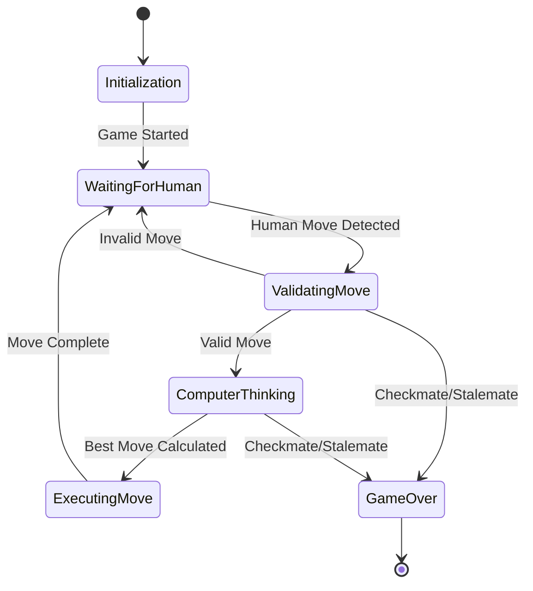
```mermaid
stateDiagram-v2
    [*] --> Initialization
    Initialization --> WaitingForHuman: Game Started
    WaitingForHuman --> ValidatingMove: Human Move Detected
    ValidatingMove --> WaitingForHuman: Invalid Move
    ValidatingMove --> ComputerThinking: Valid Move
    ComputerThinking --> ExecutingMove: Best Move Calculated
    ExecutingMove --> WaitingForHuman: Move Complete
    ValidatingMove --> GameOver: Checkmate/Stalemate
    ComputerThinking --> GameOver: Checkmate/Stalemate
    GameOver --> [*]
```

### System Interaction Flows

The following sequence diagrams illustrate detailed interaction patterns between system components for different workflows.

#### System Initialization Flow

The sequence diagram below shows the startup sequence when launching the ChessMate system. The game_management node coordinates initialization across all controllers, setting operating modes and preparing for gameplay.

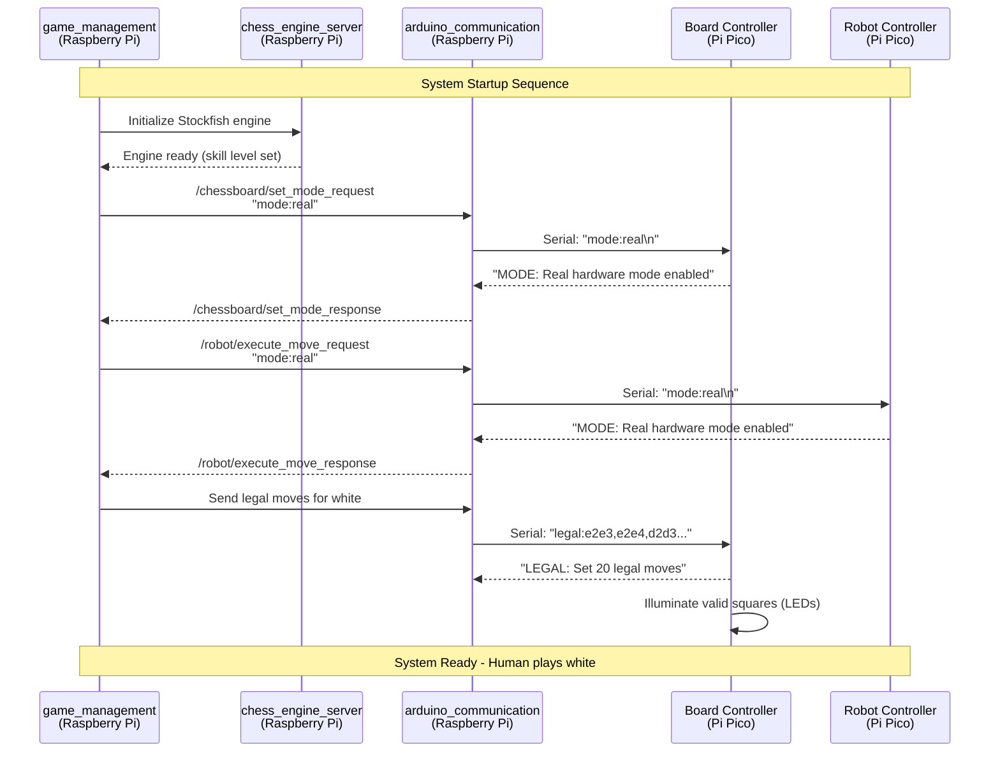
```mermaid
sequenceDiagram
    participant GM as game_management<br/>(Raspberry Pi)
    participant CE as chess_engine_server<br/>(Raspberry Pi)
    participant AC as arduino_communication<br/>(Raspberry Pi)
    participant BC as Board Controller<br/>(Pi Pico)
    participant RC as Robot Controller<br/>(Pi Pico)

    Note over GM,RC: System Startup Sequence

    GM->>CE: Initialize Stockfish engine
    CE-->>GM: Engine ready (skill level set)

    GM->>AC: /chessboard/set_mode_request<br/>"mode:real"
    AC->>BC: Serial: "mode:real\n"
    BC-->>AC: "MODE: Real hardware mode enabled"
    AC-->>GM: /chessboard/set_mode_response

    GM->>AC: /robot/execute_move_request<br/>"mode:real"
    AC->>RC: Serial: "mode:real\n"
    RC-->>AC: "MODE: Real hardware mode enabled"
    AC-->>GM: /robot/execute_move_response

    GM->>AC: Send legal moves for white
    AC->>BC: Serial: "legal:e2e3,e2e4,d2d3..."
    BC-->>AC: "LEGAL: Set 20 legal moves"
    BC->>BC: Illuminate valid squares (LEDs)

    Note over GM,RC: System Ready - Human plays white
```

#### Computer Move Execution Flow

This diagram illustrates the complete workflow when the computer calculates and executes a chess move. The process includes engine thinking time (2-8 seconds), move transmission, and physical piece movement with animatronic feedback.

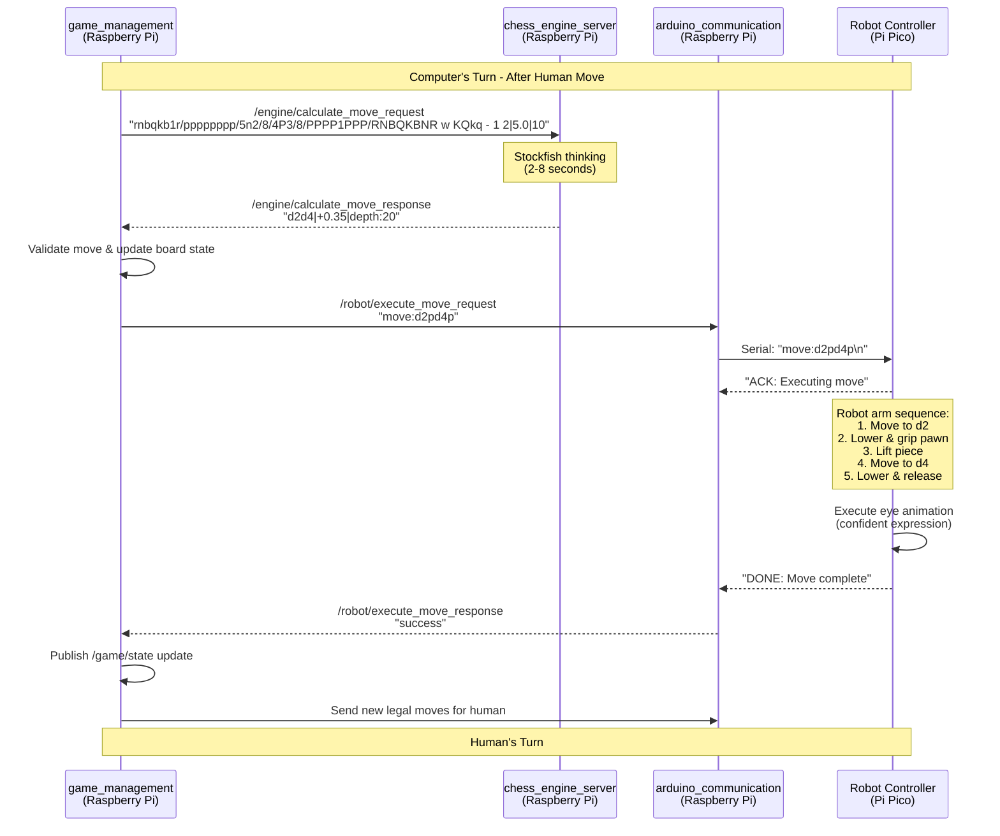
```mermaid
sequenceDiagram
    participant GM as game_management<br/>(Raspberry Pi)
    participant CE as chess_engine_server<br/>(Raspberry Pi)
    participant AC as arduino_communication<br/>(Raspberry Pi)
    participant RC as Robot Controller<br/>(Pi Pico)

    Note over GM,RC: Computer's Turn - After Human Move

    GM->>CE: /engine/calculate_move_request<br/>"rnbqkb1r/pppppppp/5n2/8/4P3/8/PPPP1PPP/RNBQKBNR w KQkq - 1 2|5.0|10"

    Note over CE: Stockfish thinking<br/>(2-8 seconds)

    CE-->>GM: /engine/calculate_move_response<br/>"d2d4|+0.35|depth:20"

    GM->>GM: Validate move & update board state

    GM->>AC: /robot/execute_move_request<br/>"move:d2pd4p"
    AC->>RC: Serial: "move:d2pd4p\n"
    RC-->>AC: "ACK: Executing move"

    Note over RC: Robot arm sequence:<br/>1. Move to d2<br/>2. Lower & grip pawn<br/>3. Lift piece<br/>4. Move to d4<br/>5. Lower & release

    RC->>RC: Execute eye animation<br/>(confident expression)

    RC-->>AC: "DONE: Move complete"
    AC-->>GM: /robot/execute_move_response<br/>"success"

    GM->>GM: Publish /game/state update
    GM->>AC: Send new legal moves for human

    Note over GM,RC: Human's Turn
```

#### Human Move Detection Flow

This diagram shows the process when a human player physically moves a piece on the chessboard. Hall effect sensors detect the movement, and the system validates and processes the move.

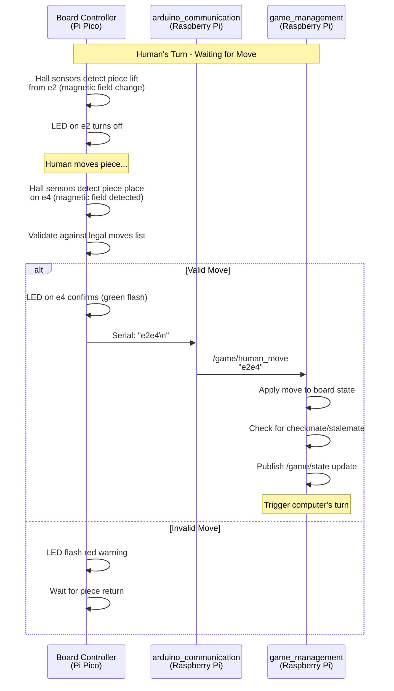
```mermaid
sequenceDiagram
    participant BC as Board Controller<br/>(Pi Pico)
    participant AC as arduino_communication<br/>(Raspberry Pi)
    participant GM as game_management<br/>(Raspberry Pi)

    Note over BC,GM: Human's Turn - Waiting for Move

    BC->>BC: Hall sensors detect piece lift<br/>from e2 (magnetic field change)
    BC->>BC: LED on e2 turns off

    Note over BC: Human moves piece...

    BC->>BC: Hall sensors detect piece place<br/>on e4 (magnetic field detected)
    BC->>BC: Validate against legal moves list

    alt Valid Move
        BC->>BC: LED on e4 confirms (green flash)
        BC->>AC: Serial: "e2e4\n"
        AC->>GM: /game/human_move<br/>"e2e4"
        GM->>GM: Apply move to board state
        GM->>GM: Check for checkmate/stalemate
        GM->>GM: Publish /game/state update
        Note over GM: Trigger computer's turn
    else Invalid Move
        BC->>BC: LED flash red warning
        BC->>BC: Wait for piece return
    end
```

#### LCD Display and Menu Operation Flow

This diagram demonstrates the user interface workflow for menu navigation and game control using the rotary encoder and OLED display on the Board Controller.

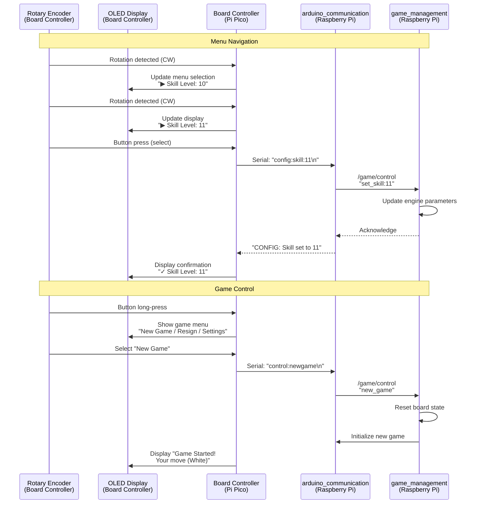
```mermaid
sequenceDiagram
    participant RE as Rotary Encoder<br/>(Board Controller)
    participant LCD as OLED Display<br/>(Board Controller)
    participant BC as Board Controller<br/>(Pi Pico)
    participant AC as arduino_communication<br/>(Raspberry Pi)
    participant GM as game_management<br/>(Raspberry Pi)

    Note over RE,GM: Menu Navigation

    RE->>BC: Rotation detected (CW)
    BC->>LCD: Update menu selection<br/>"▶ Skill Level: 10"

    RE->>BC: Rotation detected (CW)
    BC->>LCD: Update display<br/>"▶ Skill Level: 11"

    RE->>BC: Button press (select)
    BC->>AC: Serial: "config:skill:11\n"
    AC->>GM: /game/control<br/>"set_skill:11"
    GM->>GM: Update engine parameters
    GM-->>AC: Acknowledge
    AC-->>BC: "CONFIG: Skill set to 11"
    BC->>LCD: Display confirmation<br/>"✓ Skill Level: 11"

    Note over RE,GM: Game Control

    RE->>BC: Button long-press
    BC->>LCD: Show game menu<br/>"New Game / Resign / Settings"

    RE->>BC: Select "New Game"
    BC->>AC: Serial: "control:newgame\n"
    AC->>GM: /game/control<br/>"new_game"
    GM->>GM: Reset board state
    GM->>AC: Initialize new game
    BC->>LCD: Display "Game Started!<br/>Your move (White)"
```

#### Robot Animatronics Flow

This diagram shows how the robot expresses emotions and reactions through servo-driven eye movements and gestures during gameplay events.

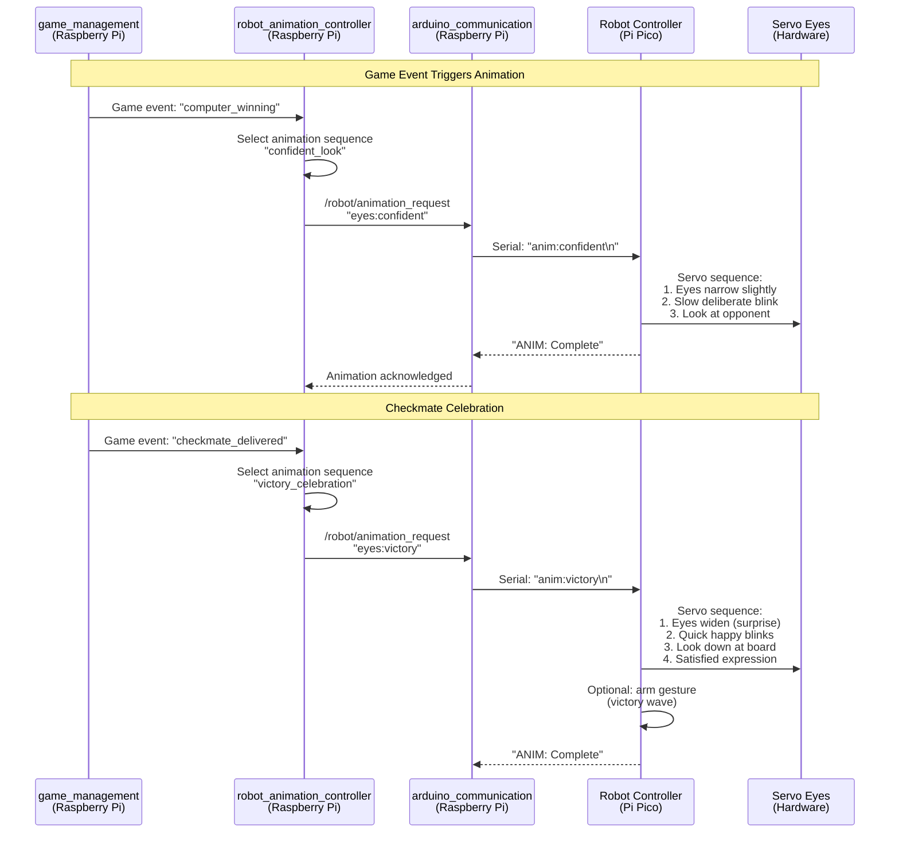
```mermaid
sequenceDiagram
    participant GM as game_management<br/>(Raspberry Pi)
    participant RAC as robot_animation_controller<br/>(Raspberry Pi)
    participant AC as arduino_communication<br/>(Raspberry Pi)
    participant RC as Robot Controller<br/>(Pi Pico)
    participant Eyes as Servo Eyes<br/>(Hardware)

    Note over GM,Eyes: Game Event Triggers Animation

    GM->>RAC: Game event: "computer_winning"
    RAC->>RAC: Select animation sequence<br/>"confident_look"

    RAC->>AC: /robot/animation_request<br/>"eyes:confident"
    AC->>RC: Serial: "anim:confident\n"

    RC->>Eyes: Servo sequence:<br/>1. Eyes narrow slightly<br/>2. Slow deliberate blink<br/>3. Look at opponent

    RC-->>AC: "ANIM: Complete"
    AC-->>RAC: Animation acknowledged

    Note over GM,Eyes: Checkmate Celebration

    GM->>RAC: Game event: "checkmate_delivered"
    RAC->>RAC: Select animation sequence<br/>"victory_celebration"

    RAC->>AC: /robot/animation_request<br/>"eyes:victory"
    AC->>RC: Serial: "anim:victory\n"

    RC->>Eyes: Servo sequence:<br/>1. Eyes widen (surprise)<br/>2. Quick happy blinks<br/>3. Look down at board<br/>4. Satisfied expression

    RC->>RC: Optional: arm gesture<br/>(victory wave)

    RC-->>AC: "ANIM: Complete"
```

---

## Getting Started

### Prerequisites

| Requirement | Specification |
|-------------|---------------|
| OS | Ubuntu 22.04 LTS (Jammy) |
| ROS2 | Humble Hawksbill |
| Hardware | Raspberry Pi (4GB+ recommended) |
| Python | 3.10+ |
| Dependencies | `python-chess`, `stockfish`, `pyserial` |

### Quick Start

#### Existing Setup

```bash
# Navigate to workspace
cd ~/ChessMate-ROS2

# Source ROS2 environment
source /opt/ros/humble/setup.bash
source install/setup.bash

# Launch complete chess game system (mock mode)
./scripts/launch_production_game.sh --mode mock

# Launch with real hardware
./scripts/launch_production_game.sh --mode real

# Test package functionality
python3 -c "import rclpy, chess; print('✅ ChessMate packages ready!')"

# Run system tests
./scripts/test_chessmate_system.sh game --mode mock --duration 300
```

#### New Setup

```bash
git clone https://github.com/mvipin/ChessMate-ROS2.git
cd ChessMate-ROS2
sudo apt update && sudo apt install -y ros-humble-desktop python3-pip stockfish
pip3 install python-chess pyserial
./scripts/build.sh  # Auto-detects x86 or ARM platform
source /opt/ros/humble/setup.bash && source install/setup.bash
./scripts/test_controllers.sh
```

### Development Setup

See [ROS2 Conversion Roadmap](docs/ROS2_CONVERSION_ROADMAP.md).

---

## Testing

### Overview

ChessMate uses a multi-level testing approach that progresses from isolated controller tests to full system integration. Tests can run in mock mode (simulated hardware) or real mode (physical hardware connected).

### Test Levels

| Level | Description | Command |
|-------|-------------|---------|
| **Level 0** | Pi Pico controllers (no ROS2) | `./scripts/test_chessmate_system.sh pico --mode mock --controller both` |
| **Level 1** | ROS2 integration | `./scripts/test_chessmate_system.sh ros2 --mode mock --controller both` |
| **Level 2** | Complete chess game | `./scripts/test_chessmate_system.sh game --mode mock --duration 300` |

### Running Tests

**Test Scripts:**

| Script | Description |
|--------|-------------|
| `test_chessmate_system.sh` | Main test launcher with menu-driven interface for all test levels |
| `test_complete_game.py` | Full game simulation with dual controller integration |
| `cleanup_chessmate_processes.sh` | Cleanup script for terminating test processes |

**test_chessmate_system.sh Options:**

| Option | Description |
|--------|-------------|
| 1 | ChessBoard Controller only - Tests board sensing and human move detection |
| 2 | Robot Controller only - Tests robotic arm control and move execution |
| 3 | Complete game simulation - Full integration test with both controllers |
| 4-5 | Interactive modes - Manual testing with real-time command input |
| 6 | All tests (automated) - Runs complete test suite |

**test_complete_game.py Modes:**
```bash
python3 scripts/test_complete_game.py full        # Complete game simulation
python3 scripts/test_complete_game.py individual  # Individual controller tests
python3 scripts/test_complete_game.py init        # Game initialization only
```

**Common Commands:**
```bash
# Mock game simulation (5 minutes)
./scripts/test_chessmate_system.sh game --mode mock --duration 300

# Real hardware game
./scripts/test_chessmate_system.sh game --mode real --duration 600 --skill-level 10

# Cleanup between tests
./scripts/cleanup_chessmate_processes.sh

# Run automated test suite
./scripts/test_chessmate_system.sh  # Then choose option 6

# Help
./scripts/test_chessmate_system.sh --help
```

**Testing Workflow:**

*Development Testing:*
1. Test individual controllers first using their respective test options
2. Verify basic communication and command processing
3. Run integration tests using the main test launcher

*Integration Testing:*
1. Use `test_chessmate_system.sh` for comprehensive system testing
2. Start with individual controller tests (options 1-2)
3. Progress to complete game simulation (option 3)
4. Use interactive modes for debugging (options 4-5)

*Prerequisites:*
- ChessBoard Pi Pico connected via USB (`/dev/ttyACM0`)
- Robot Pi Pico connected via USB (`/dev/ttyACM1`) - optional for ChessBoard-only tests
- User in `dialout` group for USB device access
- Both controllers running appropriate firmware

### Monitoring & Diagnostics

**Real-Time Monitoring Commands:**
```bash
ros2 topic echo /game/state              # Game state
ros2 topic echo /game/human_move         # Human moves
ros2 topic echo /robot/execute_move_response  # Robot execution
rqt_graph                                 # System topology
```

**ROS2 Node Reference:**

| Node Name | Function |
|-----------|----------|
| `/arduino_communication` | Hardware interface for chessboard and robot arm |
| `/chess_engine_server` | Stockfish-based move calculation |
| `/game_management` | Central game orchestration and state management |
| `/full_game_integration_test` | Test harness simulating human moves |

**ROS2 Topic Reference:**

*Game-Related Topics:*
| Topic | Type | Publisher | Subscriber(s) |
|-------|------|-----------|---------------|
| `/game/state` | `chessmate/msg/GameState` | game_management | full_game_integration_test |
| `/game/control` | `std_msgs/msg/String` | full_game_integration_test | game_management |
| `/game/human_move` | `std_msgs/msg/String` | arduino_communication, test | game_management |

*Chess Engine Topics:*
| Topic | Type | Publisher | Subscriber |
|-------|------|-----------|------------|
| `/engine/calculate_move_request` | `std_msgs/msg/String` | game_management | chess_engine_server |
| `/engine/calculate_move_response` | `std_msgs/msg/String` | chess_engine_server | game_management |

*Robot Control Topics:*
| Topic | Type | Publisher | Subscriber |
|-------|------|-----------|------------|
| `/robot/execute_move_request` | `std_msgs/msg/String` | game_management | arduino_communication |
| `/robot/execute_move_response` | `std_msgs/msg/String` | arduino_communication | game_management |

*Chessboard Controller Topics:*
| Topic | Type | Publisher | Subscriber |
|-------|------|-----------|------------|
| `/chessboard/legal_moves` | `std_msgs/msg/String` | game_management | arduino_communication |
| `/chessboard/set_mode_request` | `std_msgs/msg/String` | game_management | arduino_communication |
| `/chessboard/set_mode_response` | `std_msgs/msg/String` | arduino_communication | game_management |

**Communication Graph:**

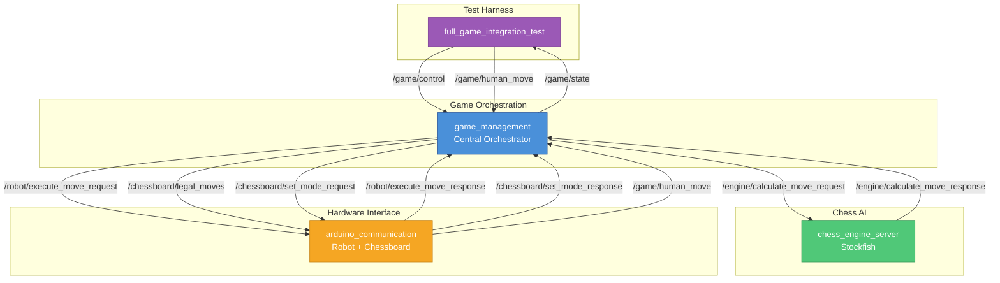
```mermaid
flowchart TB
    subgraph TestHarness["Test Harness"]
        TEST[full_game_integration_test]
    end

    subgraph GameOrchestration["Game Orchestration"]
        GM[game_management<br/>Central Orchestrator]
    end

    subgraph ChessAI["Chess AI"]
        ENGINE[chess_engine_server<br/>Stockfish]
    end

    subgraph Hardware["Hardware Interface"]
        ARDUINO[arduino_communication<br/>Robot + Chessboard]
    end

    %% Test to Game Management
    TEST -->|/game/control| GM
    TEST -->|/game/human_move| GM

    %% Game Management to Chess Engine
    GM -->|/engine/calculate_move_request| ENGINE
    ENGINE -->|/engine/calculate_move_response| GM

    %% Game Management to Arduino
    GM -->|/robot/execute_move_request| ARDUINO
    ARDUINO -->|/robot/execute_move_response| GM
    GM -->|/chessboard/legal_moves| ARDUINO
    GM -->|/chessboard/set_mode_request| ARDUINO
    ARDUINO -->|/chessboard/set_mode_response| GM
    ARDUINO -->|/game/human_move| GM

    %% Game State broadcast
    GM -->|/game/state| TEST

    %% Styling
    style GM fill:#4a90d9,stroke:#2c5aa0,color:#fff
    style ENGINE fill:#50c878,stroke:#3a9a5c,color:#fff
    style ARDUINO fill:#f5a623,stroke:#c7851a,color:#fff
    style TEST fill:#9b59b6,stroke:#7d3c98,color:#fff
```

### Diagnostic Session Example

This example shows a complete ROS2 system diagnostics session captured during an end-to-end ChessMate system test.

**Test Result**: ✅ SUCCESS - 15 moves played in ~3 minutes

**Test Execution Timeline:**

| Timestamp | Phase | Activity |
|-----------|-------|----------|
| 07:14:02 | Start | Test initialization |
| 07:14:14 | Init | Nodes discovered, first capture |
| 07:14:18 | Play | Game started, moves 1-4 |
| 07:15:07 | Play | Capture 1 - moves 5-6 |
| 07:15:46 | Play | Capture 2 - moves 7-10 |
| 07:16:27 | End | Capture 3 - test completed, nodes shutting down |
| 07:17:05 | Final | Final capture - all nodes terminated |

**Diagnostic Files Generated:**

| File | Description |
|------|-------------|
| [`system_test_output.log`](test/system/diagnostics/system_test_output.log) | Complete test execution log |
| [`topic_game_state.log`](test/system/diagnostics/topic_game_state.log) | Game state topic messages |
| [`topic_human_move.log`](test/system/diagnostics/topic_human_move.log) | Human move commands |
| [`topic_execute_move_response.log`](test/system/diagnostics/topic_execute_move_response.log) | Robot move confirmations |
| [`node_info.log`](test/system/diagnostics/node_info.log) | Detailed node pub/sub info |
| [`service_list.log`](test/system/diagnostics/service_list.log) | ROS2 services timeline |

**System Verification Checklist:**

✅ All ROS2 nodes initialized and communicated correctly
✅ Topic-based pub/sub communication working as designed
✅ Game orchestration properly coordinated all components
✅ Engine-robot-chessboard loop executed 15 complete turns
✅ Clean shutdown without message loss

### Troubleshooting

| Issue | Solutions |
|-------|-----------|
| Controllers not found | Check USB connections, verify device paths (`/dev/ttyACM0`, `/dev/ttyACM1`), try different USB ports |
| Permission errors | Add user to dialout group: `sudo usermod -a -G dialout $USER`, then log out/in |
| Communication failures | Verify baud rate (9600), check controller firmware is running, try resetting controllers |
| Test failures | Run individual controller tests first, enable debug mode in controller firmware |
| Timeout errors | Ensure controllers are not busy, check for responsive controller state |

---

## Contributing

1. Fork and create a feature branch: `git checkout -b feature/your-feature`
2. Follow ROS2 coding standards and Python PEP 8
3. Add tests and run: `./scripts/test_chessmate_system.sh game --mode mock --duration 300`
4. Submit a pull request with clear description

---

## License

MIT License - see [LICENSE](LICENSE) file.

---

## Acknowledgments

Thanks to the ROS2 Community, Stockfish Team, Raspberry Pi Foundation, and Hackaday Community.

---

**Links:** [GitHub](https://github.com/mvipin/ChessMate-ROS2) | [Hackaday](https://hackaday.io/project/203400-chessmate-ros2-chess-robot) | [Issues](https://github.com/mvipin/ChessMate-ROS2/issues)
