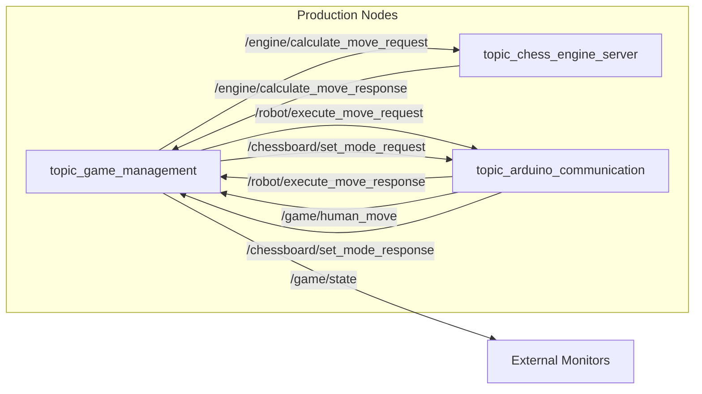
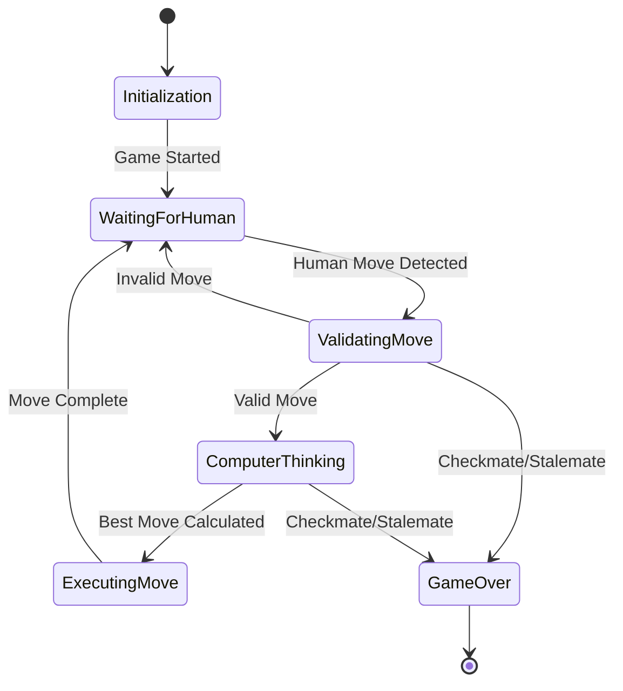

# ChessMate - ROS2 Chess Robot

[](https://docs.ros.org/en/humble/)
[](https://www.raspberrypi.org/)
[](LICENSE)
[](https://hackaday.io/project/203400-chessmate-ros2-chess-robot)


**An AI chess master with expressive eyes, custom electronics, and a precision arm that will checkmate you with style!**

ChessMate is a fully autonomous chess-playing robot that physically moves pieces on a real chessboard. Built with ROS2, it combines professional-grade chess AI (Stockfish), custom electronics with home-fabricated PCBs, a 6-DOF SCARA robotic arm, and expressive animatronics to create an engaging chess opponent with personality.

## Table of Contents

- [Key Features](#key-features)
- [System Architecture](#system-architecture)
- [ROS2 Packages](#ros2-packages)
  - [chessmate_msgs](#chessmate_msgs)
  - [chessmate_hardware](#chessmate_hardware)
  - [chessmate_engine](#chessmate_engine)
  - [chessmate_description](#chessmate_description)
  - [chessmate_kinematics](#chessmate_kinematics)
- [Getting Started](#getting-started)
- [Building the Hardware](#building-the-hardware)
- [Testing](#testing)
- [Documentation](#documentation)

---

## Key Features

| Category | Features |
|----------|----------|
| **Chess Intelligence** | Stockfish engine integration (skill levels 1-20), real-time move validation, FEN notation tracking, position analysis |
| **Robotic Precision** | 6-DOF SCARA arm, sub-millimeter positioning accuracy, adaptive gripping, four-corner calibration |
| **Board Sensing** | 64 hall effect sensors, custom CNC-fabricated PCBs, 8×8 NeoPixel LED matrix, real-time move detection |
| **User Interface** | OLED display with rotary encoder, expressive servo-driven eyes, text-to-speech synthesis |
| **Architecture** | Three-controller distributed design (Pi + 2× Pico), topic-based ROS2 communication, mock/real mode support |

---

## System Architecture

ChessMate uses a distributed three-controller architecture with topic-based ROS2 communication. Each controller handles specific responsibilities, communicating via serial protocols and ROS2 topics.

### Controller Responsibilities

| Controller | Role | Responsibilities |
|------------|------|------------------|
| **Raspberry Pi 4** | The Brain | Chess engine integration and move calculation, game state management and rule enforcement, audio processing for speech and sound effects, system-wide coordination and safety oversight |
| **Board Controller** | The Senses | Real-time monitoring of all 64 chess piece positions, visual feedback through LED matrix, user interface management (OLED, buttons, rotary encoder), move detection and validation, player interaction handling |
| **Mechanical Controller** | The Body | Precision robotic arm movement control, adaptive gripper operation for different pieces, animatronic facial expressions and eye movements, safety systems and emergency stop coordination, real-time motion execution |

### Hardware Architecture

The diagram below shows the physical hardware components and their connections. The Raspberry Pi 4 serves as the central brain, communicating with two Pi Pico microcontrollers via USB serial at 9600 baud. The Board Controller handles all sensing and user interface components, while the Mechanical Controller manages actuation and motion.


### ROS2 Node Communication

The diagram below illustrates the topic-based communication between ROS2 nodes. The Game Management node orchestrates all game logic, requesting move calculations from the Chess Engine Server and dispatching physical moves to the Arduino Communication node. Human moves detected by the board sensors flow back through the communication node to the game manager.



### Game Flow State Machine

The state machine below shows the complete game flow from initialization through game completion. The system waits for human moves, validates them against legal move lists, calculates computer responses using Stockfish, and executes physical piece movements. The cycle continues until checkmate, stalemate, or resignation.



### Active Topics

| Topic | Type | Description |
|-------|------|-------------|
| `/game/state` | GameState | Current game status and board position |
| `/game/control` | String | Game control commands (start, pause, reset) |
| `/game/human_move` | String | Detected human moves from chessboard (UCI format) |
| `/engine/calculate_move_request` | String | Engine calculation requests (FEN position) |
| `/engine/calculate_move_response` | String | Engine responses (best move + evaluation) |
| `/robot/execute_move_request` | String | Robot movement commands (6-char format) |
| `/robot/execute_move_response` | String | Robot movement confirmations |

### Serial Protocol

**ChessBoard Controller (/dev/ttyACM0):**
```
Host → Board: "mode:real\n" | "mode:mock\n" | "legal:e2e4,d2d4,g1f3\n"
Board → Host: "e2e4\n" (4-character UCI move)
```

**Robot Controller (/dev/ttyACM1):**
```
Host → Robot: "mode:real\n" | "mode:mock\n" | "move:e2pe4p\n"
Robot → Host: "ACK: Executing move\n" → "DONE: Move complete\n"

6-Character Move Format: [from_square][piece][to_square][dest_piece]
Examples: e2pe4p (pawn e2→e4), g1nf3n (knight g1→f3), e1kg1k (castling)
```

---

## ROS2 Packages

### chessmate_msgs

Custom ROS2 message definitions for inter-node communication.

**Message Definitions:**

| Message | Fields | Description |
|---------|--------|-------------|
| `BoardState` | `fen_position`, `square_occupancy[64]`, `white_to_move`, `castling_rights` | Chess board state representation |
| `ChessMove` | `from_square`, `to_square`, `piece_type`, `move_type`, `is_capture`, `algebraic_notation`, `uci_notation` | Complete chess move definition |
| `GameState` | `board_state`, `game_phase`, `game_status`, `move_history[]`, `legal_moves[]` | Full game state with history |
| `RobotStatus` | `status`, `x/y/z_position`, `gripper_closed`, `has_error`, `error_message` | Robot controller feedback |

**Service Definitions:**

| Service | Request | Response |
|---------|---------|----------|
| `CalculateMove` | `board_fen`, `time_limit`, `skill_level` | `success`, `best_move`, `uci_move`, `evaluation` |
| `ExecuteMove` | `move`, `validate_move`, `timeout` | `success`, `message`, `execution_time` |
| `ValidateMove` | `board_fen`, `proposed_move` | `is_legal`, `validation_message`, `legal_moves[]` |

**Usage:**
```python
from chessmate_msgs.msg import BoardState, ChessMove, GameState
from chessmate_msgs.srv import ExecuteMove, CalculateMove

move = ChessMove()
move.from_square = "e2"
move.to_square = "e4"
move.piece_type = "pawn"
move.algebraic_notation = "e4"
```

```bash
# Inspect message structure
ros2 interface show chessmate_msgs/msg/BoardState
ros2 interface show chessmate_msgs/srv/ExecuteMove
```

### chessmate_hardware

Hardware abstraction layer for GPIO, serial communication, and peripheral devices.

**Nodes:**

| Node | Purpose | Key Topics |
|------|---------|------------|
| `topic_arduino_communication` | Serial interface to Pi Pico controllers | Pub: `/game/human_move`, Sub: `/robot/execute_move_request` |
| `rotary_encoder_node` | User input from rotary encoder | Pub: `RotaryEncoderEvent` |
| `lcd_display_node` | OLED display management | Sub: `LCDCommand` |

**Configuration Parameters:**

| Parameter | Default | Description |
|-----------|---------|-------------|
| `board_controller_port` | `/dev/ttyACM0` | Serial port for board controller |
| `arm_controller_port` | `/dev/ttyACM1` | Serial port for arm controller |
| `baud_rate` | `9600` | Serial communication baud rate |
| `use_mock_hardware` | auto-detect | Enable mock mode for development |

**Launch:**
```bash
# Mock mode for development
ros2 launch chessmate_hardware unified_hardware.launch.py platform:=linux_host hardware_mode:=mock

# Real hardware on Raspberry Pi
ros2 launch chessmate_hardware unified_hardware.launch.py platform:=raspberry_pi hardware_mode:=real
```

### chessmate_engine

Stockfish chess engine integration and game management.

**Nodes:**

| Node | Purpose | Topics |
|------|---------|--------|
| `topic_chess_engine_server` | Stockfish UCI interface | Sub: `/engine/calculate_move_request`, Pub: `/engine/calculate_move_response` |
| `topic_game_management` | Game orchestration | Pub: `/game/state`, Sub: `/game/human_move`, `/game/control` |

**Configuration Parameters:**

| Parameter | Default | Description |
|-----------|---------|-------------|
| `stockfish_path` | `/usr/games/stockfish` | Path to Stockfish binary |
| `default_skill_level` | `10` | Engine skill (1-20) |
| `default_time_limit` | `5.0` | Thinking time in seconds |
| `hash_size_mb` | `128` | Engine hash table size |

**Usage:**
```bash
# Start engine node
ros2 run chessmate_engine topic_chess_engine_server

# Request move calculation
ros2 topic pub --once /engine/calculate_move_request std_msgs/String \
  "{data: 'rnbqkbnr/pppppppp/8/8/8/8/PPPPPPPP/RNBQKBNR w KQkq - 0 1|5.0|10'}"
```

### chessmate_description

URDF robot model, 3D meshes, and visualization configuration.

**Contents:**
- `urdf/` - URDF/xacro robot descriptions
- `meshes/visual/` - High-quality STL meshes for visualization
- `meshes/collision/` - Simplified collision meshes
- `rviz/` - Pre-configured RViz setups
- `launch/` - Visualization launchers

**Robot Specifications:**

| Joint | Type | Range | Max Velocity |
|-------|------|-------|--------------|
| J1 (Base) | Revolute | ±180° | 90°/s |
| J2 (Shoulder) | Revolute | ±90° | 90°/s |
| J3 (Upper Arm) | Revolute | ±135° | 90°/s |
| J4 (Forearm) | Revolute | ±180° | 120°/s |
| J5 (Wrist) | Revolute | ±90° | 120°/s |
| J6 (Gripper) | Prismatic | 0-50mm | 10mm/s |

**Launch:**
```bash
# RViz visualization
ros2 launch chessmate_description display.launch.py use_gui:=true

# Gazebo simulation
ros2 launch chessmate_description gazebo.launch.py world:=chess_table
```

### chessmate_kinematics

SCARA inverse kinematics and chess square coordinate mapping.

**Components:**

| Module | Purpose |
|--------|---------|
| `scara_kinematics.py` | Forward/inverse kinematics solver |
| `chess_coordinate_mapper.py` | Map chess notation to robot coordinates |
| `kinematics_server.py` | ROS2 service interface |

**Configuration (`config/scara_config.yaml`):**
```yaml
arm:
  link1_length: 0.15  # meters
  link2_length: 0.15
  z_min: 0.0
  z_max: 0.1
board:
  square_size: 0.05   # meters
  origin_offset: [0.1, 0.1, 0.0]
```

---

## Getting Started

### Prerequisites

| Requirement | Specification |
|-------------|---------------|
| OS | Ubuntu 22.04 LTS (Jammy) |
| ROS2 | Humble Hawksbill |
| Hardware | Raspberry Pi 4 (4GB+ recommended) |
| Python | 3.10+ |
| Dependencies | `python-chess`, `stockfish`, `pyserial` |

### Quick Start

#### Existing Setup

```bash
# Navigate to workspace
cd ~/ChessMate-ROS2

# Source ROS2 environment
source /opt/ros/humble/setup.bash
source install/setup.bash

# Launch complete chess game system (mock mode)
./scripts/launch_production_game.sh --mode mock

# Launch with real hardware
./scripts/launch_production_game.sh --mode real

# Test package functionality
python3 -c "import rclpy, chess; print('✅ ChessMate packages ready!')"

# Run system tests
./scripts/test_chessmate_system.sh game --mode mock --duration 300
```

#### New Setup

```bash
git clone https://github.com/mvipin/ChessMate-ROS2.git
cd ChessMate-ROS2
sudo apt update && sudo apt install -y ros-humble-desktop python3-pip stockfish
pip3 install python-chess pyserial
./scripts/build.sh  # Auto-detects x86 or ARM platform
source /opt/ros/humble/setup.bash && source install/setup.bash
./scripts/test_controllers.sh
```

### Development Setup

See [ROS2 Conversion Roadmap](docs/ROS2_CONVERSION_ROADMAP.md).

---

## Building the Hardware

### Mechanical System

| Specification | Value |
|---------------|-------|
| Arm Type | 6-DOF SCARA |
| Workspace | Full 8×8 chessboard |
| Repeatability | Sub-millimeter |
| Actuation | NEMA 17 steppers with microstepping |

### Electronic System

| Component | Description |
|-----------|-------------|
| **Sensors** | 64 hall effect sensors with I2C expanders, CNC-milled PCBs |
| **Display** | 8×8 NeoPixel LED matrix + SSD1306 OLED |
| **Controllers** | Dual Pi Pico microcontrollers |
| **Motors** | NEMA 17 steppers + servo motors |

### Calibration

**Sensor Calibration:** Place pieces in starting positions → record baseline → set detection thresholds → validate all squares.

**Arm Calibration:** Home position via limit switches → four-corner board registration → 64-point square mapping → EEPROM storage.

For detailed hardware documentation, CAD files, and schematics: [Hackaday Project](https://hackaday.io/project/203400-chessmate-ros2-chess-robot)

---

## Testing

### Test Levels

| Level | Description | Command |
|-------|-------------|---------|
| **Level 0** | Pi Pico controllers (no ROS2) | `./scripts/test_chessmate_system.sh pico --mode mock --controller both` |
| **Level 1** | ROS2 integration | `./scripts/test_chessmate_system.sh ros2 --mode mock --controller both` |
| **Level 2** | Complete chess game | `./scripts/test_chessmate_system.sh game --mode mock --duration 300` |

### Common Commands

```bash
# Mock game simulation (5 minutes)
./scripts/test_chessmate_system.sh game --mode mock --duration 300

# Real hardware game
./scripts/test_chessmate_system.sh game --mode real --duration 600 --skill-level 10

# Cleanup between tests
./scripts/cleanup_chessmate_processes.sh

# Help
./scripts/test_chessmate_system.sh --help
```

### Monitoring

```bash
ros2 topic echo /game/state              # Game state
ros2 topic echo /game/human_move         # Human moves
ros2 topic echo /robot/execute_move_response  # Robot execution
rqt_graph                                 # System topology
```

See [Testing Guide](docs/TESTING_GUIDE.md) for detailed procedures.

---

## Documentation

| Category | Resources |
|----------|-----------|
| **Technical** | [Architecture & Data Flow](docs/ARCHITECTURE_AND_DATA_FLOW.md), [ROS2 Conversion Roadmap](docs/ROS2_CONVERSION_ROADMAP.md), [Testing Strategy](docs/ROS2_INTEGRATION_TESTING_STRATEGY.md) |
| **Packages** | [Messages](src/chessmate_msgs/README.md), [Hardware](src/chessmate_hardware/README.md), [Engine](src/chessmate_engine/README.md) |
| **Controllers** | [ChessBoard Controller](controllers/chessboard/README.md), [Robot Controller](controllers/robot/README.md), [Test Scripts](scripts/README.md) |
| **External** | [Hackaday Project](https://hackaday.io/project/203400-chessmate-ros2-chess-robot), [ROS2 Humble Docs](https://docs.ros.org/en/humble/), [Stockfish](https://stockfishchess.org/) |

---

## Contributing

1. Fork and create a feature branch: `git checkout -b feature/your-feature`
2. Follow ROS2 coding standards and Python PEP 8
3. Add tests and run: `./scripts/test_chessmate_system.sh game --mode mock --duration 300`
4. Submit a pull request with clear description

---

## License

MIT License - see [LICENSE](LICENSE) file.

---

## Acknowledgments

Thanks to the ROS2 Community, Stockfish Team, Raspberry Pi Foundation, and Hackaday Community.

---

**Links:** [GitHub](https://github.com/mvipin/ChessMate-ROS2) | [Hackaday](https://hackaday.io/project/203400-chessmate-ros2-chess-robot) | [Issues](https://github.com/mvipin/ChessMate-ROS2/issues)
